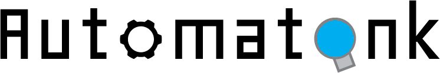

Automatank is a **programming** game where players write scripts to purchase **upgrades** and **control** tanks to be the last one standing! 

See a comprehensive guide about the game's mechanics and scripting by paying a visit to the game's [manual](jerry-licious.github.io/automatank/manual.pdf), and download the game in the [releases](https://github.com/marianopolis-ai/Automatank/releases).

# Develop

This game is made with the [Godot Python](https://github.com/touilleMan/godot-python), and the repository itself does not contain the extension. To develop the game on your computer, follow these instructions:

* After cloning the game, open the project on Godot. **Do not open any scenes.**
* From the **AssetLib**, download the `PythonScript` extension.
* Reload the project.

The game should work after this. If it doesn't, it's likely because the Python script got detached from the script tank scene (`scenes/ScriptControlledTank.tscn`). Simply download a new one from the repository, replace it, and the game should be good to go!