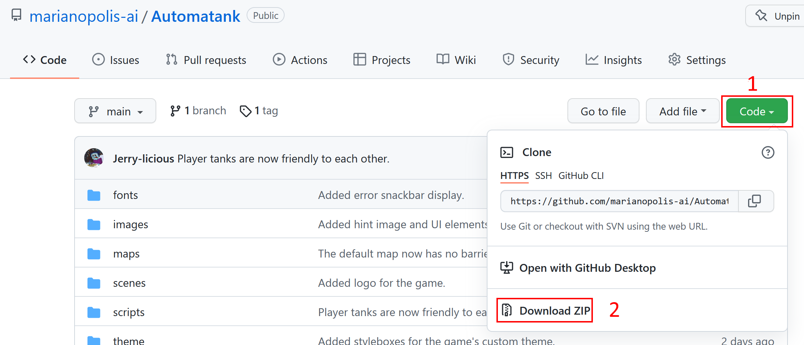
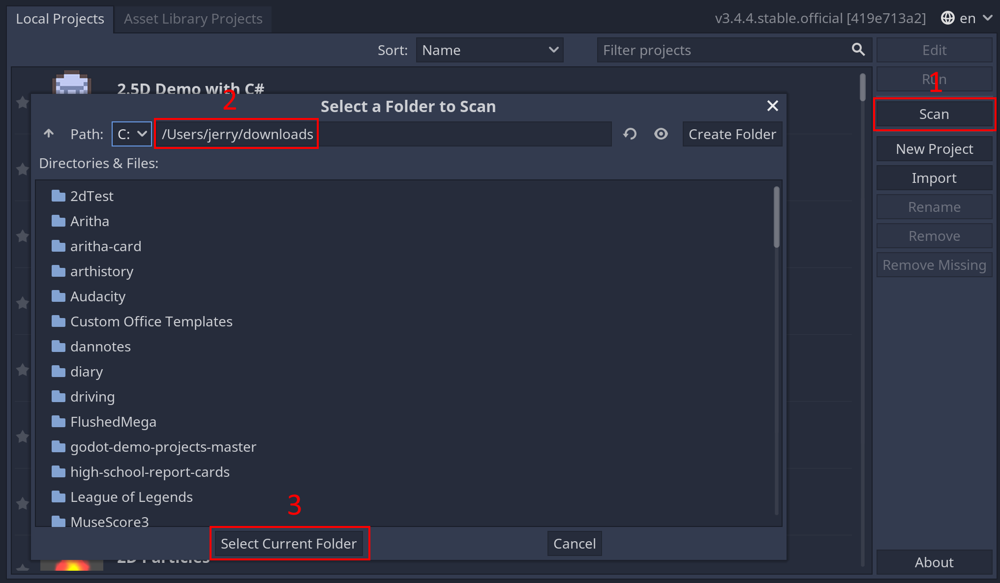
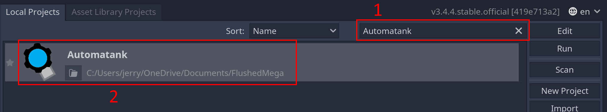
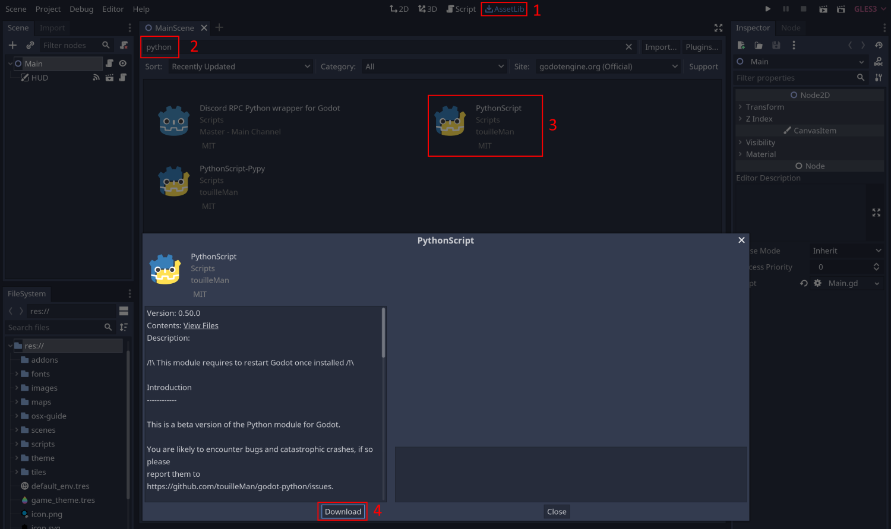
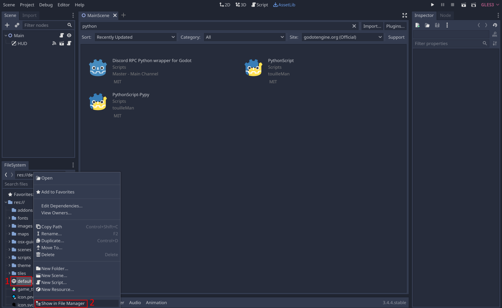
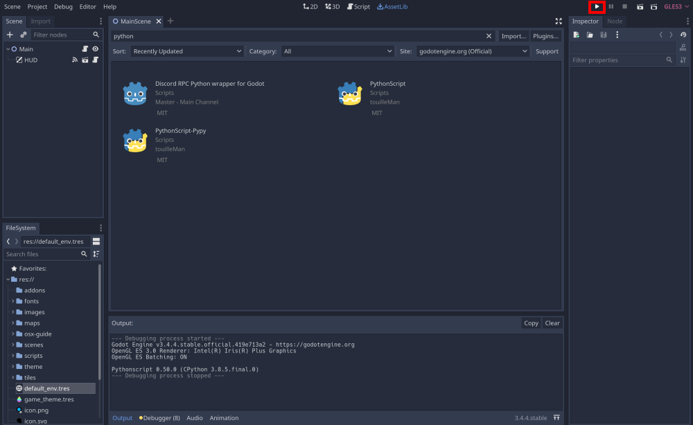

# Mac OSX Game Install Guide

I'm sorry, I cannot put Apple out of its hubris. Every step you do here is to bypass a bad decision deliberately made by Apple.

### Download Godot

Apple does not allow us to package our software and ship it without paying them a yearly subscription of USD99, which means that there are no ways for us to ship a working version of the game. 

To play the game, you would have to download all the source code and open them in the **engine** we use - Godot. 

1. Go to Godot's [download page for OSX](https://godotengine.org/download/osx).
2. Download the **standard version** (**Universal 64-bit (x86_64 + Apple Silicon)**) of the engine. You should get a zip file that's approximately 70mb.
3. Extract the zip folder. This will give you the app *directly*. You can double-click to start the engine to see if it works.

### Download Project Source

To have the game working, you need to download the source code of the game. 

1. Go to the [GitHub Repository](https://github.com/marianopolis-ai/Automatank) of the game.
2. Click on the green **code** button, then click on **Download Zip**. This should give you a very small zip folder.
3. Extract the zip folder.

### Project Setup

After having the files ready, you will need to setup the project as follows:

1. Open the **Godot Engine** that you have just downloaded.

2. Click on the **Scan** button. On the **path** text field, enter the path to your **download** folder (or wherever you have extracted the source code in), then click **Select Current Folder**.

3. A project named **Automatank** should appear on your local project list. If there are a lot of projects, enter **Automatank** in the **filter projects** text field.
4. **Double-click** the project to open it in the editor. You should see a few errors popping up in the bottom, don't worry about them, we're going to fix them.

5. Go to the **centre top** and click on **AssetLib**.
6. On the search bar, look up **python**.
7. Select the plugin named **PythonScript**. **It has to be this one exactly or otherwise the project will not work**.
8. Press **Download** to install the plugin, this should take a few minutes.

9. On the **bottom left**, you should see a panel named **file system**. **Right-click** on a **file**, not a **folder**, and then click **__show__ in file manager**. This should open the project folder in **Finder**.
10. **Close the project by closing the engine.**
11. With the project folder opened and the engine closed, open the **scenes** folder, and inside it, open **ScriptControlledTank.tscn**. If you cannot open it, use **right-click > open with > text edit**.
12. Go to [this link](https://raw.githubusercontent.com/marianopolis-ai/Automatank/main/scenes/ScriptControlledTank.tscn) and copy the content of the page.
13. Paste the content inside **ScriptControlledTank.tscn** and save it.
14. Use Godot (steps 3-4) to open up the project.

### Playing the Game

Since you cannot compile or export the game, you will have to play from the engine.

- Go to the **top-right** corner and find the **play** button. Clicking it should launch the game.